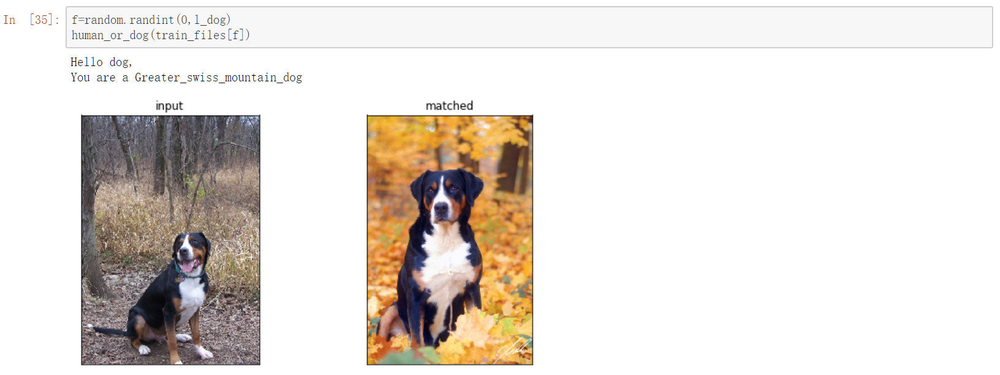
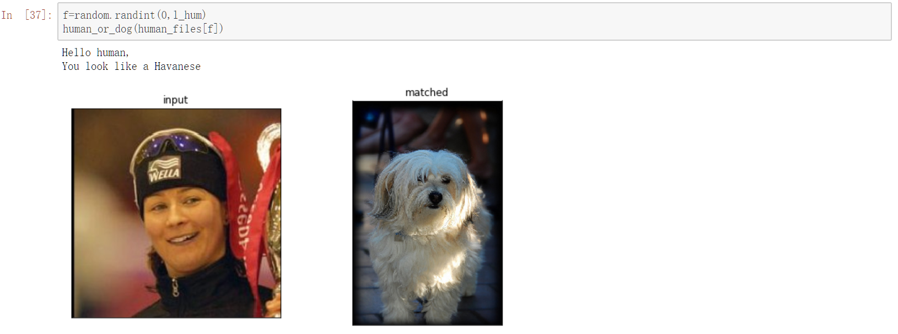
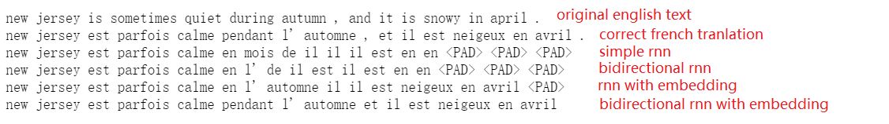

## Dog Project

The project uses tranfer learning to build a dog breed classifier.
A fully connected layer is appended to the end of Xception model and getting trained.
The test accuracy of the classifier reaches 83.7%.

While applying the classifer to human...

## Facial Keypoints Detection
Detect faces using a Haar Cascade Classifier and train a simple CNN to further detect facial keypoints on the face. And the funny part is to put various makeups on face based on facial keypoints.

## Machine Translation

Different models are trained and test on over 137K English-French translation pairs.
The final bidirectional rnn with embedding model reaches over 95% test accuracy.
